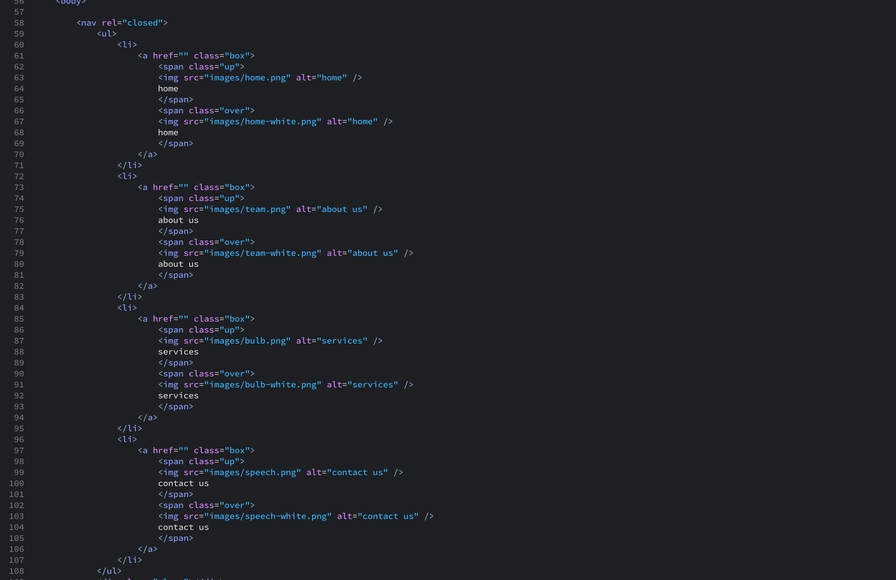
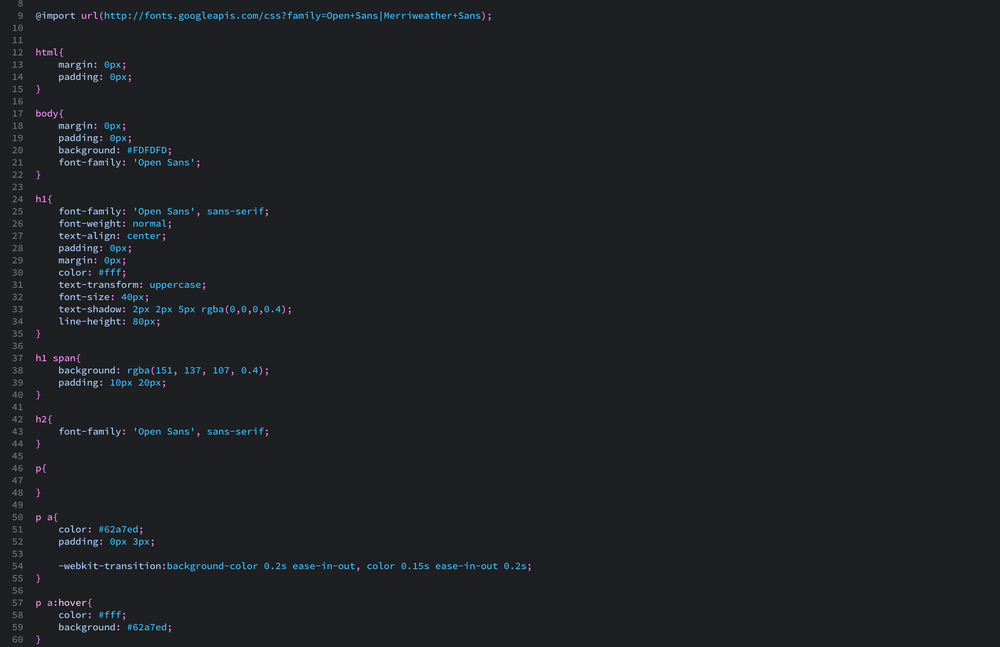
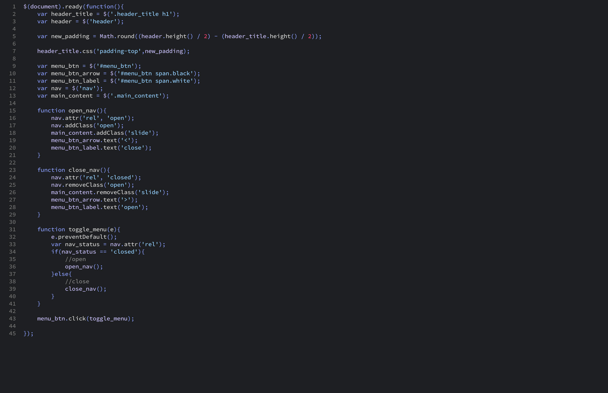
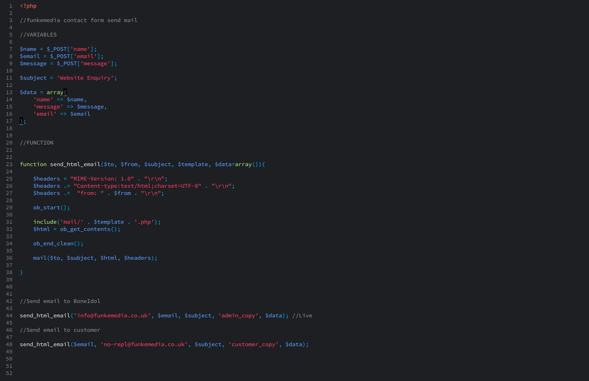

# Funkemedia Dark Theme

Dark Theme based on Dreamweaver's colour coding by Funkemedia Ltd.

Great for people who are used to the colour coding from Dreamwaver, but prefer a darker theme.

It's easy on the eye and makes use of the different class modes so you can easily see the difference in programming languages.

Enjoy, 
Steven McGuinness
Funkemedia Ltd

--------------------

Examples

HTML

CSS

JavaScript

PHP

